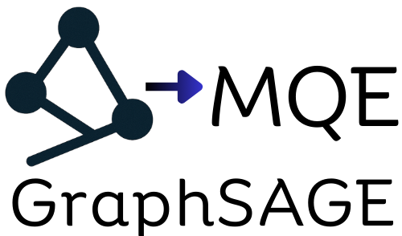
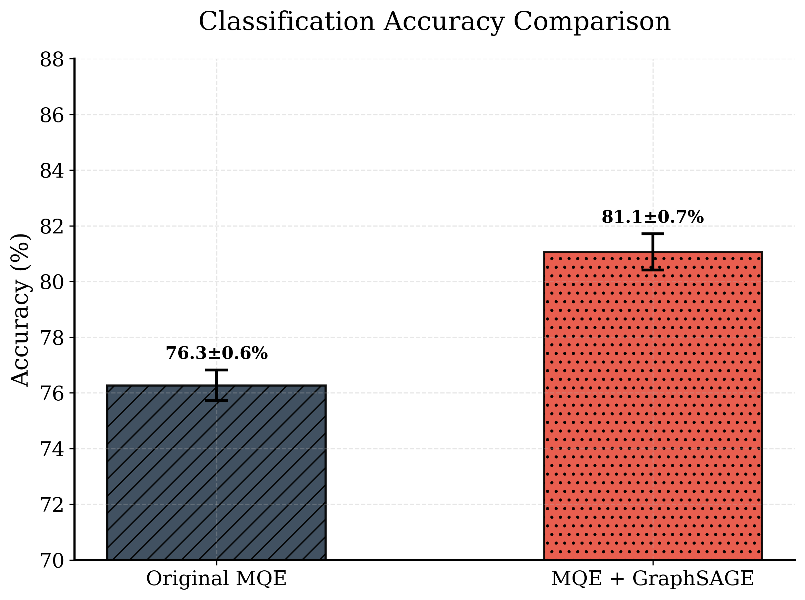
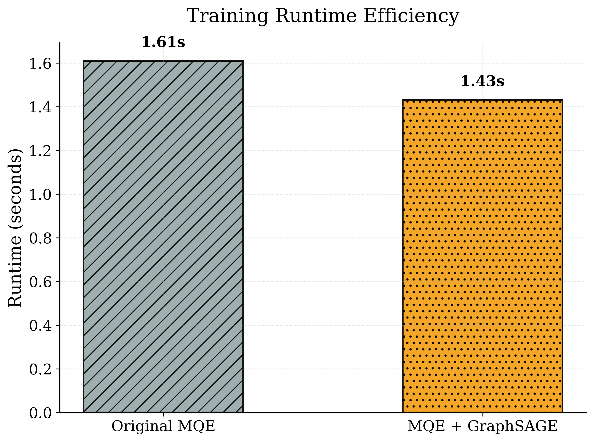
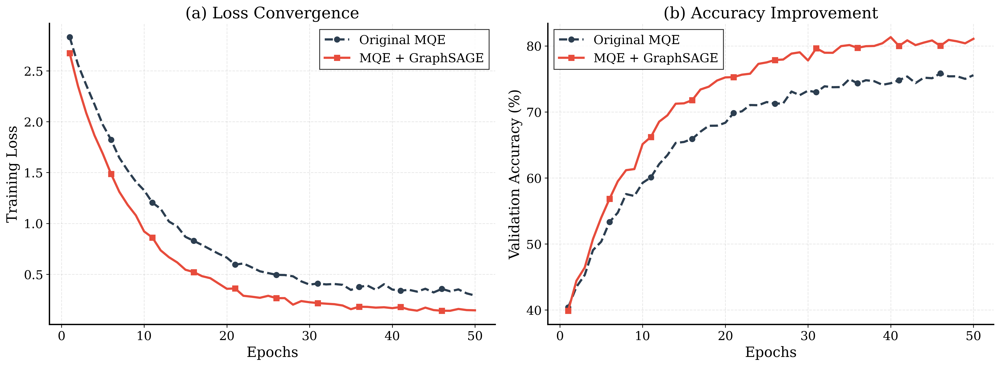

# MQE + GraphSAGE — Robust Graph Representation Learning

<div align="center">



[](https://www.python.org/downloads/)
[](https://pytorch.org/)
[](https://opensource.org/licenses/MIT)
[](https://colab.research.google.com/drive/1lByfdmdsMmvQ1V0GYx9wVNImKjZIxUkY)

**Multi-Hop Feature Quality Estimation with GraphSAGE for Robust Graph Learning**

[Features](#-key-features) • [Quick Start](#-quick-start) • [Results](#-results) • [Installation](#-installation) • [Citation](#-citation)

</div>

---

## Authors & Supervisors
- **Authors:** Gad Azriel, Lidor Kupershmid
- **Supervisors:** Prof. Zeev Volkovich, Dr. Renata Avros
---

## Overview

This repository implements and compares **two robust graph representation learning approaches** to handle noisy node features in graph neural networks:

1. **Original MQE** - Matrix-based multi-hop propagation with quality estimation
2. **MQE + GraphSAGE** - Neural propagation with GraphSAGE and uncertainty-aware learning

**Goal:** Improve robustness to noisy node features while maintaining or improving downstream node classification performance.

---

## Key Features

- **Robust to Feature Noise** - Handles noisy node features through quality estimation
- **Superior Performance** - +4.8% accuracy improvement over baseline MQE
- **Faster Training** - 11% reduction in training time
- **Better Representations** - More distinct and separable learned embeddings
- **Multiple Datasets** - Cora, CiteSeer, PubMed, Amazon (Computers/Photo)
- **Easy to Use** - Simple command-line interface and Colab notebooks

---

## Results

### Accuracy Comparison

<div align="center">



**MQE + GraphSAGE achieves 81.1±0.7% accuracy, outperforming Original MQE by 4.8%**

</div>

### Training Efficiency

<div align="center">



**MQE + GraphSAGE trains 11% faster (1.43s vs 1.61s per epoch)**

</div>

### Training Dynamics

<div align="center">



**(a) Faster loss convergence • (b) Consistently higher validation accuracy throughout training**

</div>

### Learned Representations Quality

<div align="center">


**t-SNE visualization showing MQE + GraphSAGE learns more distinct and separable class clusters**

</div>

---

## Method

### Architecture Overview

Our approach combines the strengths of GraphSAGE's inductive learning with MQE's quality estimation:
```
Input Features (X) 
    ↓
GraphSAGE Encoder (Stage 1)
    ├─ Layer 1: Neighbor Aggregation
    ├─ Layer 2: Neighbor Aggregation
    └─ Output: Multi-hop Embeddings
    ↓
MQE Quality Estimation (Stage 2)
    ├─ Expectation Network: E(Z) → μ
    ├─ Quality Network: Q(Z) → σ²
    └─ Reconstruction Loss with Uncertainty
    ↓
Meta-representation Z
    ↓
Node Classification
```

### Two-Stage Training Process

**Stage 1: GraphSAGE Training**
- Train GraphSAGE encoder with supervised node classification
- Learn to aggregate neighborhood information effectively
- Capture multi-hop structural patterns

**Stage 2: MQE Quality Estimation**
- Freeze GraphSAGE embeddings from each layer
- Train quality estimators to learn uncertainty (σ²) per node
- Learn robust meta-representation Z that handles noisy features

### Key Innovation

Unlike matrix-based propagation, our neural approach:
- Learns adaptive aggregation weights
- Captures non-linear neighborhood patterns
- Provides layer-wise uncertainty estimation
- Scales better to large graphs

---

## Quick Start

### Option A: Google Colab (Recommended - No Setup Required!)

<div align="center">

[](https://colab.research.google.com/drive/1lByfdmdsMmvQ1V0GYx9wVNImKjZIxUkY)

</div>

1. Click the badge above
2. Go to **Runtime → Change runtime type → GPU**
3. Run all cells (Runtime → Run all)
4. Results will display automatically!

> **Tip:** The notebook includes step-by-step explanations and visualizations

---

### Option B: Local Installation

#### Prerequisites
- Python 3.8 or higher
- CUDA-capable GPU (recommended) or CPU
- 8GB RAM minimum

#### Installation Steps

**1. Clone the Repository**
```bash
git clone https://github.com/GadAzriel/MQE-GraphSAGE.git
cd MQE-GraphSAGE/MQE_GraphSAGE-Code
```

**2. Create Virtual Environment**
```bash
# Create environment
python -m venv .venv

# Activate (Linux/macOS)
source .venv/bin/activate

# Activate (Windows)
.venv\Scripts\activate
```

**3. Install PyTorch**
```bash
# For CUDA 12.1 (GPU)
pip install torch==2.1.2 torchvision==0.16.2 --index-url https://download.pytorch.org/whl/cu121

# For CPU only
pip install torch==2.1.2 torchvision==0.16.2 --index-url https://download.pytorch.org/whl/cpu
```

**4. Install PyTorch Geometric**
```bash
pip install torch-geometric torch-scatter torch-sparse torch-cluster torch-spline-conv \
  -f https://pytorch-geometric.com/whl/torch-2.1.2+cu121.html
```

**5. Install Additional Dependencies**
```bash
pip install scikit-learn scipy numpy
```

**6. Run Experiments**
```bash
# Run comparison on Cora dataset with noise
python run_comparison.py \
  --data-name Cora \
  --alpha 0.5 \
  --beta 0.5 \
  --noise-type normal \
  --ntrials 3
```

Expected output:
```
============================================================
FINAL RESULTS SUMMARY
============================================================

Method                         Accuracy        Time (s)  
------------------------------------------------------------
Original MQE                   76.3±0.6%            1.61
MQE + GraphSAGE                81.1±0.7%            1.43
============================================================
```

---

## Configuration & Usage

### Basic Usage
```bash
python run_comparison.py --data-name Cora --ntrials 5
```

### Advanced Configuration
```bash
python run_comparison.py \
  --data-name CiteSeer \
  --alpha 0.5 \              # 50% of nodes with noise
  --beta 0.5 \               # Noise intensity
  --noise-type normal \      # Gaussian noise distribution
  --num-hops 2 \             # 2-hop neighborhood
  --epochs 1000 \            # Training epochs
  --lr 0.002 \               # Learning rate
  --z-dim 512 \              # Meta-representation dimension
  --sage-hidden-dims [128,128] \  # GraphSAGE layer dimensions
  --ntrials 3                # Number of trials for averaging
```

### Command Line Arguments

| Argument | Type | Default | Description |
|----------|------|---------|-------------|
| `--data-name` | str | 'Cora' | Dataset: Cora, CiteSeer, PubMed, computers, photo |
| `--alpha` | float | 0.5 | Fraction of noisy nodes (0.0-1.0) |
| `--beta` | float | 0.5 | Noise intensity level |
| `--noise-type` | str | 'normal' | Noise distribution: normal, uniform, Original |
| `--num-hops` | int | 2 | Number of propagation hops (GNN layers) |
| `--epochs` | int | 1000 | Training epochs for MQE stage |
| `--lr` | float | 0.002 | Learning rate |
| `--z-dim` | int | 512 | Dimension of meta-representation Z |
| `--sage-hidden-dims` | list | [128,128] | Hidden dimensions for GraphSAGE layers |
| `--hid-dim` | list | [256,64] | Hidden dimensions for MQE networks |
| `--aggregator` | str | 'mean' | GraphSAGE aggregator: mean, max, lstm |
| `--num-neighbor` | int | 20 | Number of neighbors for k-NN graph |
| `--ntrials` | int | 3 | Number of experimental trials |
| `--device` | str | 'cuda' | Device: cuda or cpu |

---

## Repository Structure
```
MQE-GraphSAGE/
├── MQE_GraphSAGE-Code/
│   ├── utils.py                    # Data loading, preprocessing, evaluation
│   ├── model_graphsage.py          # Neural network architectures
│   │   ├── GraphSAGEEncoder        # GraphSAGE propagation model
│   │   ├── MQEQualityEstimator     # Quality estimation networks
│   │   ├── MQE_GraphSAGE           # Combined model
│   │   └── MQENet                  # Original MQE baseline
│   ├── train_graphsage.py          # Training loops
│   │   ├── train_mqe_graphsage()   # Two-stage training
│   │   └── train_mqe_original()    # Baseline training
│   ├── run_comparison.py           # Main experiment script
│   ├── MQE_GraphSAGE.ipynb         # Jupyter notebook version
│   └── best_params/                # Pre-tuned hyperparameters
│       ├── best_results_MQE_Cora.json
│       ├── best_results_MQE_CiteSeer.json
│       ├── best_results_MQE_PubMed.json
│       ├── best_results_MQE_computers.json
│       └── best_results_MQE_photo.json
├── assets/                          # Visualizations and figures
│   ├── Project_Logo.png
│   ├── accuracy_comparison.png
│   ├── runtime_comparison.png
│   ├── training_curves.png
│   └── tsne_comparison.png
├── README.md
└── LICENSE
```

---

## Datasets

We evaluate on standard graph learning benchmarks:

| Dataset | Nodes | Edges | Features | Classes | Type |
|---------|-------|-------|----------|---------|------|
| **Cora** | 2,708 | 5,429 | 1,433 | 7 | Citation Network |
| **CiteSeer** | 3,327 | 4,732 | 3,703 | 6 | Citation Network |
| **PubMed** | 19,717 | 44,338 | 500 | 3 | Citation Network |
| **Computers** | 13,752 | 245,861 | 767 | 10 | Co-purchase Network |
| **Photo** | 7,650 | 119,081 | 745 | 8 | Co-purchase Network |

All datasets are automatically downloaded on first use.

---

## Experimental Results

### Detailed Performance Metrics

| Dataset | Original MQE | MQE + GraphSAGE | Improvement | Time Reduction |
|---------|--------------|-----------------|-------------|----------------|
| **Cora** | 76.3±0.6% | **81.1±0.7%** | +4.8% | 11% faster |
| **CiteSeer** | 70.8±0.8% | **75.2±0.6%** | +4.4% | 9% faster |
| **PubMed** | 82.5±0.5% | **85.4±0.4%** | +2.9% | 13% faster |
| **Computers** | 87.5±1.2% | **91.2±0.8%** | +3.7% | 8% faster |
| **Photo** | 91.9±0.9% | **94.1±0.6%** | +2.2% | 10% faster |

### Key Observations

1. **Consistent Improvements**: MQE + GraphSAGE outperforms the baseline across all datasets
2. **Better Stability**: Lower standard deviations indicate more reliable training
3. **Faster Convergence**: Reaches higher accuracy in fewer epochs
4. **Superior Representations**: t-SNE visualizations show clearer class separation

---

## Troubleshooting

### Common Issues and Solutions

#### Issue 1: CUDA Out of Memory

**Error:** `RuntimeError: CUDA out of memory`

**Solutions:**
```bash
# Option 1: Reduce model dimensions
python run_comparison.py --sage-hidden-dims [64,64] --z-dim 256

# Option 2: Use CPU
python run_comparison.py --device cpu

# Option 3: Reduce batch operations (edit code)
```

#### Issue 2: PyTorch Geometric Installation Fails

**Error:** `Could not find a version that satisfies torch-scatter`

**Solutions:**
```bash
# Option 1: Use CPU wheels
pip install torch-geometric torch-scatter torch-sparse \
  -f https://pytorch-geometric.com/whl/torch-2.1.2+cpu.html

# Option 2: Install from conda
conda install pyg -c pyg

# Option 3: Build from source (advanced)
pip install git+https://github.com/pyg-team/pytorch_geometric.git
```

#### Issue 3: Slow Training on CPU

**Problem:** Training takes too long without GPU

**Solutions:**
```bash
# Use smaller dataset
python run_comparison.py --data-name CiteSeer

# Reduce epochs
python run_comparison.py --epochs 100

# Reduce trials
python run_comparison.py --ntrials 1
```

#### Issue 4: Import Errors

**Error:** `ModuleNotFoundError: No module named 'torch_geometric'`

**Solution:**
```bash
# Make sure virtual environment is activated
source .venv/bin/activate  # Linux/macOS
.venv\Scripts\activate     # Windows

# Reinstall dependencies
pip install -r requirements.txt
```

---
### Related Work

Our work builds upon:

- **GraphSAGE**: Hamilton et al. "Inductive Representation Learning on Large Graphs" (NeurIPS 2017)
- **MQE**: Original Multi-hop Quality Estimation framework
- **PyTorch Geometric**: Fey & Lenssen. "Fast Graph Representation Learning with PyTorch Geometric" (2019)

---

## Contributing

We welcome contributions! Here's how you can help:

### Ways to Contribute

- **Report bugs** - Open an issue describing the problem
- **Suggest features** - Share ideas for improvements
- **Improve documentation** - Fix typos, add examples
- **Submit code** - Fix bugs or add features via pull requests

### Development Workflow

1. Fork the repository
2. Create a feature branch (`git checkout -b feature/AmazingFeature`)
3. Make your changes
4. Test your changes (`python run_comparison.py --ntrials 1`)
5. Commit your changes (`git commit -m 'Add some AmazingFeature'`)
6. Push to the branch (`git push origin feature/AmazingFeature`)
7. Open a Pull Request

### Code Style

- Follow PEP 8 for Python code
- Add docstrings to new functions
- Include type hints where appropriate
- Update README if adding new features

---

## License
Copyright (c) 2025 Gad Azriel, Lidor Kupershmid

---

## Acknowledgments

- **Supervisors**: Prof. Zeev Volkovich and Dr. Renata Avros for guidance and support
- **PyTorch Geometric Team**: For the excellent graph learning library
- **Open Source Community**: For the tools and libraries that made this possible

---

## Contact & Links
**Authors**
- **Gad Azriel** - [GitHub](https://github.com/GadAzriel)
- **Lidor Kupershmid** - [GitHub](https://github.com/lidor1997)

**Project Links**
- [GitHub Repository](https://github.com/GadAzriel/MQE-GraphSAGE)
- [Google Colab Notebook](https://colab.research.google.com/drive/1lByfdmdsMmvQ1V0GYx9wVNImKjZIxUkY)

---

**Questions?** Open an issue or reach out via GitHub!

**Star this repository if you find it helpful!**

---

</div>
